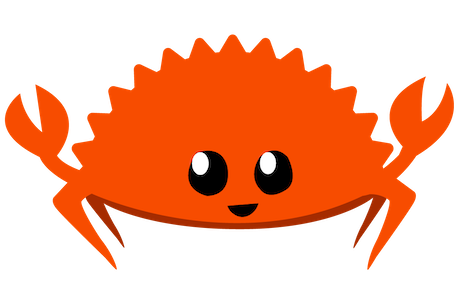

# Da Lama Ao Caos

> Este site foi criado com [Zola](https://getzola.org), um projeto para gerar site estático em rust.

O objetivo deste projeto é documentar da forma mais didática possível meu aprendizado em rust. Já iniciei esse aprendizado diversas vezes e sempre tive as mesmas dificuldade quando tento aprender na prática.

Do velho ditado: `ta achando ruim faz você`. Criei este site para fazer da minha maneira, explicar o que estou aprendendo com Rust. A ideia é sempre demonstrar os conceitos da linguagem implementando alguma coisa, útil ou não, sem esquecer da maior dor de todo dev, os testes.

Escrevendo exemplos de códigos, cookbooks, etc, através de TDD, procuro tomar nota do meu entendimento de como fazer as coisas em Rust.

Por conta disso, uma postagem hoje, pode ser atualizada com o tempo. Pode se tornar inútil, mas, para mim, o importante é que eu transcreva meu aprendizado, porque assim eu consigo aprender também.

## Sobre o nome

`Da lama ao Caos` é uma música do grandioso Chico Science e Nação Zumbi. Além da música e composição ser magnífica, a ideia é fazer um trocadilho com o mascote não oficial do rust, o carangueiro Ferris, e um dos lares dos carangueijos, o mangue.

## Contribuir com o site.

Desenvolvido usando Zola, utiliza [Tera Templates](https://keats.github.io/tera/docs/#templates) como html-engine-builder. Para estilização está sendo utilizado [Tailwindcss](https://tailwindcss.com/).

As cores utilizadas nos temas são:

- blue, indigo
- orange, amber, yellow
- green, emerald
- pink, rose
- stone